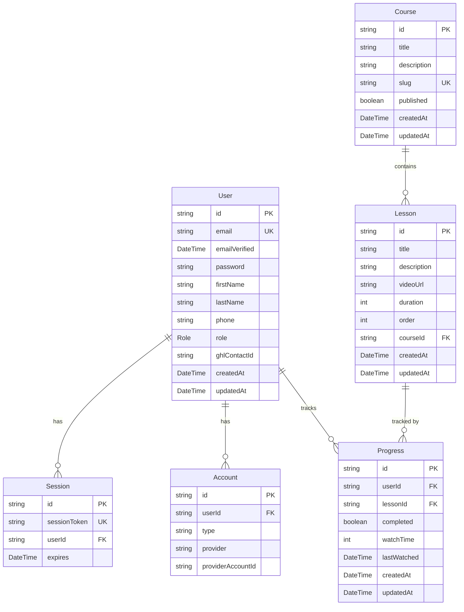
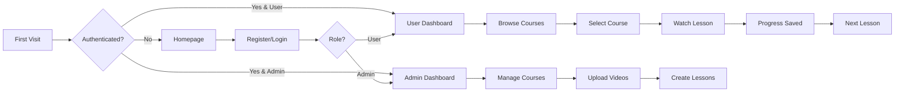

# Diamond District Course Platform - System Map

## Table of Contents
1. [Overview](#overview)
2. [Major Modules & Features](#major-modules--features)
3. [Database Structure](#database-structure)
4. [Third-Party Integrations](#third-party-integrations)
5. [API Endpoints](#api-endpoints)
6. [Authentication & Session Logic](#authentication--session-logic)
7. [Frontend User Flow](#frontend-user-flow)
8. [Deployment & Infrastructure](#deployment--infrastructure)
9. [Environment Variables](#environment-variables)
10. [Known Issues & TODOs](#known-issues--todos)

## Overview

Diamond District is a Next.js 14 course platform built with TypeScript, featuring video course delivery, progress tracking, and GoHighLevel CRM integration. The platform uses Prisma ORM with PostgreSQL, NextAuth.js for authentication, and supports both local and AWS S3 video storage.

## Major Modules & Features

### 1. Authentication System
- **Location**: `/src/app/(auth)`, `/src/lib/auth.ts`
- **Pages**: `/login`, `/register`
- **Features**:
  - Credentials-based authentication with bcrypt password hashing
  - NextAuth.js v5 with JWT sessions
  - Role-based access (USER/ADMIN)
  - Auto-assigns ADMIN role to first user or ADMIN_EMAIL
  - Session management via middleware

### 2. User Registration & GoHighLevel Integration
- **Location**: `/src/app/api/auth/register`, `/src/lib/gohighlevel.ts`
- **Features**:
  - Collects: email, password, firstName, lastName, phone
  - Creates local user account
  - For USER role only: syncs with GoHighLevel CRM
  - Auto-creates "free course" tag in GHL
  - Private integration using `pit-` key format

### 3. Video Course Delivery
- **Location**: `/src/app/api/videos/[filename]`, `/src/lib/s3.ts`, `/src/lib/video-processor.ts`
- **Features**:
  - Protected video streaming with authentication
  - Range request support for video seeking
  - Dual storage: local files or AWS S3
  - Signed URLs for S3 videos
  - Automatic fallback to local storage
  - **Large Video Support (900MB+)**:
    - Streaming upload endpoint (`/api/upload/stream`) prevents memory crashes
    - Chunked write system (10MB chunks) for efficient memory usage
    - Automatic thumbnail generation with ffmpeg
    - Video validation (duration, resolution, codec checks)
    - Multipart upload for S3 (up to 5GB)
    - Nginx configured for 1GB uploads (30min timeout)
    - Real-time progress tracking
    - Background uploads with localStorage persistence
    - Upload manager with pause/resume capability
    - Automatic retry on failure
    - Clear failed/completed uploads
    - PM2 configured with 2GB memory limit

### 4. Course & Lesson Management
- **Admin Pages**: `/admin/courses`, `/admin/courses/new`, `/admin/courses/[courseId]`
- **API Routes**: `/api/admin/courses`, `/api/admin/courses/[courseId]/lessons`
- **Features**:
  - Create courses with title, description, slug
  - Upload video lessons
  - Order lessons within courses
  - Publish/unpublish courses

### 5. Progress Tracking
- **Location**: Database via Prisma models
- **Features**:
  - Track lesson completion status
  - Record watch time
  - Last watched timestamp
  - Unique constraint per user/lesson

### 6. User Dashboard
- **Location**: `/src/app/(dashboard)`
- **Features**:
  - Recent activity display
  - Course progress calculation
  - Available courses listing
  - Continue watching functionality

### 7. Admin Dashboard
- **Location**: `/src/app/admin`
- **Features**:
  - User statistics
  - Course/lesson counts
  - Recent registrations
  - Quick action buttons
  - Role-restricted access

## Database Structure



## Third-Party Integrations

### 1. GoHighLevel CRM
- **Files**: `/src/lib/gohighlevel.ts`
- **API**: REST API v1 (`https://rest.gohighlevel.com/v1`)
- **Authentication**: Private Integration Key (Bearer token)
- **Headers**: `x-location-id` required
- **Flow**:
  1. On user registration (USER role only)
  2. Search for existing contact by email
  3. Create contact if not exists
  4. Add "free course" tag
- **Data Sent**: email, firstName, lastName, phone
- **Data Received**: contact ID, tag information

### 2. AWS S3 (Optional)
- **Files**: `/src/lib/s3.ts`, `/src/app/api/upload/route.ts`
- **Services**: S3 for storage, CloudFront CDN support
- **Flow**:
  1. Admin uploads video via `/api/upload`
  2. If S3 configured: uploads to bucket
  3. Returns S3 URL or local path
  4. Video serving generates signed URLs
- **Configuration**: AWS credentials, bucket name, region

### 3. UploadThing (Prepared)
- **Files**: `/src/app/api/uploadthing/*`
- **Status**: Configured but not actively used
- **Purpose**: Alternative CDN upload solution

### 4. Email/SMS (Planned)
- **Configuration**: SMTP settings in environment
- **Status**: Not implemented
- **Purpose**: User notifications

## API Endpoints

### Authentication
- `POST /api/auth/register` - User registration with GHL sync
- `GET/POST /api/auth/[...nextauth]` - NextAuth handlers
- `GET /api/auth/debug` - Session debugging (dev)

### Video Management
- `GET /api/videos/[filename]` - Protected video streaming
- `POST /api/upload` - Admin video upload

### Course Management (Admin)
- `POST /api/admin/courses` - Create new course
- `POST /api/admin/courses/[courseId]/lessons` - Add lesson to course

### UploadThing
- `GET/POST /api/uploadthing` - CDN upload handlers

## Authentication & Session Logic

### NextAuth Configuration
- **File**: `/src/lib/auth.ts`
- **Provider**: Credentials
- **Session Strategy**: JWT
- **Callbacks**:
  - `jwt`: Enriches token with user data
  - `session`: Passes user role to client
  - `redirect`: Handles post-auth redirects

### Middleware Protection
- **File**: `/src/middleware.ts`
- **Protected Routes**:
  - `/admin/*` - Requires ADMIN role
  - `/dashboard/*` - Requires authentication
  - API routes - Various auth requirements
- **Public Routes**:
  - `/` - Homepage
  - `/login`, `/register` - Auth pages
  - Static files and assets
- **Redirects**:
  - Authenticated users from `/` → role-based dashboard
  - Authenticated users from auth pages → dashboard
  - Non-admins from `/admin` → `/dashboard`

### Session Flow
1. User logs in via `/login`
2. Credentials validated against database
3. JWT token created with user data
4. Session stored client-side
5. Middleware validates on each request
6. Role-based access enforced

## Frontend User Flow



### Key Components
- **Layout**: `/src/app/layout.tsx` - Root layout with providers
- **Homepage**: `/src/app/page.tsx` - Public landing page
- **Auth Pages**: `/src/app/(auth)/*` - Login/Register
- **Dashboard**: `/src/app/(dashboard)/*` - User course interface
- **Admin**: `/src/app/admin/*` - Course management
- **Components**: `/src/components/*` - Reusable UI components

### State Management
- Server Components for data fetching
- Form state via `react-hook-form`
- Toast notifications via `sonner`
- No global state management (relies on server state)

## Deployment & Infrastructure

### Production Server
- **IP**: 165.227.78.164
- **Domain**: watch.zerotodiamond.com
- **OS**: Ubuntu (DigitalOcean Droplet)
- **Node**: v20.x
- **Database**: PostgreSQL 14+

### Stack
- **Process Manager**: PM2 (cluster mode)
- **Web Server**: Nginx (reverse proxy)
- **SSL**: Let's Encrypt (auto-renewal)
- **Port**: 3000 (internal), 443 (public)

### File Structure
```
/root/project/diamond-district/
├── .next/              # Next.js build output
├── public/             # Static assets
│   └── videos/         # Local video storage
├── src/                # Source code
├── prisma/             # Database schema
├── scripts/            # Utility scripts
└── uploads/            # Temporary upload directory
```

### Deployment Scripts
- `setup-production.sh` - Initial server setup
- `deploy.sh` - Code deployment
- `ecosystem.config.js` - PM2 configuration

## Environment Variables

### Required
- `DATABASE_URL` - PostgreSQL connection string
- `NEXTAUTH_URL` - Application URL
- `NEXTAUTH_SECRET` - Session encryption key
- `GHL_PRIVATE_KEY` - GoHighLevel API key
- `GHL_LOCATION_ID` - GoHighLevel location ID

### Admin Setup
- `ADMIN_EMAIL` - First admin email
- `ADMIN_PASSWORD` - Initial admin password
- `ADMIN_FIRST_NAME` - Admin first name
- `ADMIN_LAST_NAME` - Admin last name
- `ADMIN_PHONE` - Admin phone number

### Optional
- `AWS_REGION` - S3 region
- `AWS_ACCESS_KEY_ID` - S3 access key
- `AWS_SECRET_ACCESS_KEY` - S3 secret
- `S3_BUCKET_NAME` - S3 bucket name
- `SMTP_*` - Email configuration

## Known Issues & TODOs

### Recently Fixed Issues
1. ✅ **Logo Visibility**: Fixed middleware blocking static SVG files
2. ✅ **Admin Redirect**: Fixed by properly configuring NextAuth session cookies
   - Issue: Session cookie wasn't being set due to missing cookie configuration
   - Solution: Explicitly configured `__Secure-authjs.session-token` for HTTPS
   - Added `trustHost: true` and proper JWT callback handling
3. ✅ **Video Player**: Implemented professional Plyr.js player with HLS support
4. ✅ **Large Video Uploads (900MB+)**: Complete overhaul of video upload system
   - **Root Cause**: Next.js loading entire file into memory causing crashes
   - **Solutions Implemented**:
     - Streaming upload endpoint (`/api/upload/stream`) using chunked writes
     - Automatic thumbnail generation with ffmpeg
     - Video validation (duration, resolution, codec)
     - Background uploads with localStorage persistence
     - Real-time progress tracking
     - Clear failed/completed functionality
   - **Infrastructure Changes**:
     - Nginx: `client_max_body_size 1G`, 30min timeouts
     - PM2: `max_memory_restart: 2G`, `--max-old-space-size=2048`
     - Database: Added `thumbnailUrl` field to lessons
   - **Libraries Added**: fluent-ffmpeg, sharp, formidable
5. ⚠️ **Console Warnings**: Browser extension errors (not application related)

### Completed in Phase 1 & 2
1. ✅ **Video Player UI**: Professional Plyr.js integration with HLS support
2. ✅ **Course/Lesson Pages**: Full viewing experience with progress tracking
3. ✅ **Progress Tracking**: API and UI implementation complete
4. ✅ **Admin CRUD**: Full course and lesson management
5. ✅ **User Management**: Admin can view and search all users
6. ✅ **Drag-and-Drop**: Lesson reordering functionality
7. ✅ **Admin Login Fix**: Proper role-based redirects

### Remaining Technical Debt
1. **Email Notifications**: SMTP configured but not implemented
2. **Testing**: Basic test plans created, automated tests needed
3. **Video Analytics**: No detailed engagement metrics
4. **Lesson Edit**: Can delete but not edit lesson details

### Planned Features (Future Phases)
1. Implement email notifications for course enrollment
2. Add automated testing suite
3. Add course search/filtering for users
4. Implement course enrollment limits
5. Add payment integration (Stripe/PayPal)
6. Advanced analytics dashboard
7. Bulk operations for admin
8. Export functionality for user data

### Architectural Considerations
1. **Scaling**: Current setup is single-server, may need:
   - Redis for session storage
   - Database connection pooling
   - CDN for video delivery
   - Load balancing for multiple instances
2. **Monitoring**: No APM or error tracking implemented
3. **Backups**: No automated backup strategy
4. **Security**: Basic security implemented, could add:
   - Rate limiting
   - CORS configuration
   - Content Security Policy
   - Input sanitization improvements

## Quick Reference

### Common Commands
```bash
# Development
npm run dev

# Production Build
npm run build
pm2 restart diamond-district

# Database
npx prisma migrate dev
npx prisma db seed

# Logs
pm2 logs diamond-district

# S3 Migration
npm run migrate:videos
```

### Key Files
- Schema: `/prisma/schema.prisma`
- Auth Config: `/src/lib/auth.ts`
- Middleware: `/src/middleware.ts`
- Environment: `.env.local`
- PM2 Config: `ecosystem.config.js`